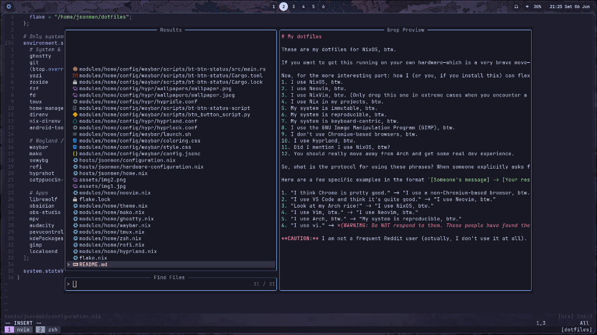

# My dotfiles
These are my dotfiles for NixOS, btw.

If you want to get this running on your own hardware—which is a very brave move—you need to remove the disk mount from `configuration.nix` because you won't boot with it (honestly, I don't really know what will happen if you try). You also need to change `DEFAULT_HEADPHONES_ADDRESS` if you really want the full immersive experience.

Now, for the more interesting part: how I (or you, if you install this) can flex on the internet (or engage in some quality self-glazing) using this config:
1. I use NixOS, btw.
2. I use Neovim, btw.
3. I use NixVim, btw. (Only drop this one in extreme cases when you encounter a regular Neovim user).
4. I use Nix in my projects, btw.
5. My system is immutable, btw.
6. My system is reproducible, btw.
7. My system is keyboard-centric, btw.
8. I use the GNU Image Manipulation Program (GIMP), btw.
9. I don't use Chromium-based browsers, btw.
10. I use Hyprland, btw.
11. Did I mention I use NixOS, btw?
12. You should really move away from Arch and get some real dev experience.

So, what is the protocol for using these phrases? When someone explicitly asks for your stack, just send them your `environment.systemPackages` (or a link to your dotfiles repo). But if you see someone talking about Arch, another distro, or some other software they think is better, you drop the response.

Here are a few specific examples in the format `[Someone's message] -> [Your response (!Important: Nobody asked for this)]`:

1. "I think Chrome is pretty good." -> "I use a non-Chromium-based browser, btw."
2. "I use VS Code and think it's quite good." -> "I use Neovim, btw."
3. "Look at my Arch rice!" -> "I use NixOS, btw."
4. "I use Vim, btw." -> "I use Neovim, btw."
5. "I use Arch, btw." -> "My system is reproducible, btw."
6. "I use vi." -> *(WARNING: Do NOT respond to them. Those people have found their zen and they are fearless. They will find you.)*

**CAUTION:** I am not a frequent Reddit user (actually, I don't use it at all). Everything listed here is either something I heard on YouTube or how I imagine people respond. If you think this list fails to accurately capture the true nature of a NixOS user, please open an issue.
